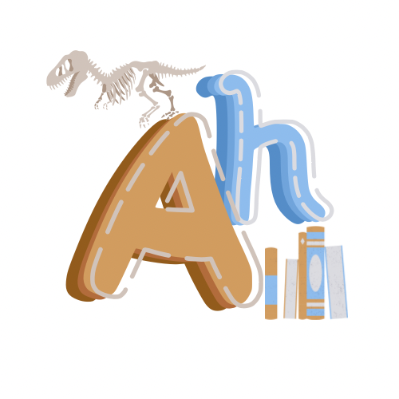

<h1 align="center"> TEAM ANTHANTA <h1>

  

  
  
  
  

 

## 📋 Table of contents
  - [Description](#description)
  - [Documentation](#docs)
  - [How to run](#install)
  - [Technologies](#technologies)
  - [Collaborators](#collaborators)

## 🔍 Description 

 Our application strikes to improve students knowledge about history of the world , if you want to learn more you can chek out our <a href="https://github.com/codingburgas/school-project-assignment-anthanta/wiki">wiki</a> 

## 📃 Documentation 
### Code & Team Documentation

[Team Documentation](https://codingburgas-my.sharepoint.com/:w:/g/personal/ddpeev21_codingburgas_bg/Ec-c6syZjMVDnJCI7s3Uw00BQvnmmQNbyudvM2FD2Pg4lg?e=DEgV5L)

### QA Documentation
[QA Documentation](https://codingburgas-my.sharepoint.com/:x:/g/personal/ddpeev21_codingburgas_bg/ERnC48FyGPFJvNcDn9b5RjIBxy9rvVdzHEW2V61qTtwhhQ?e=Rao972)
  

### Presentation
[Presentation](https://codingburgas-my.sharepoint.com/:p:/g/personal/ddpeev21_codingburgas_bg/EVh3-NxeFPZPhXGDLC1miJsBH2FFuR8a1EfNFrDnyBv4VA?e=f1UgUA)

## 🚀 How to run 

To install our application you have to copy the repo

## 🖥️ Technologies used 
### IDE & version control system:

### Programming languages & third-party libraries:

 
  
  </a> 

 <a href="https://raylib.handmade.network">

### Tools used for documentation, presentation & communication:

 
  
  <a href="https://www.microsoft.com/en-us/microsoft-365/powerpoint">
  

  

## 🧑 Collaborators 

[Filipa Popova](https://github.com/FHPopova21) - Backend developer 

[Dobril Peev](https://github.com/DDPeev21) - Backend developer

[Kristina Zheleva](https://github.com/KMZheleva21) - Scrum trainer

[Stilyan Gochev](https://github.com/SNGochev22) - Backend developer

[Lychezar Gospodinov](https://github.com/LGGospodinov22) - Backend developer

[Stefan Ivanov](https://github.com/SBIvanov22) - Backend developer

