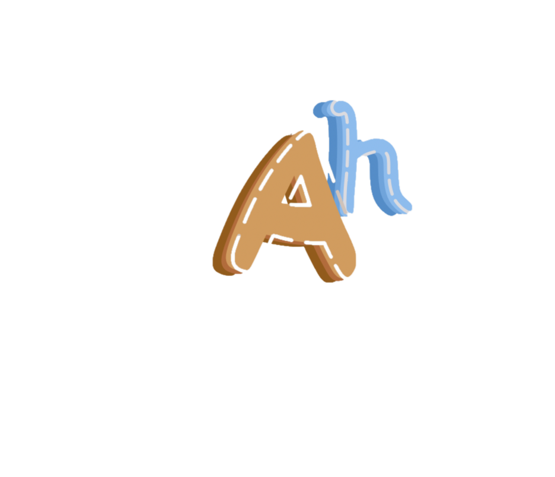
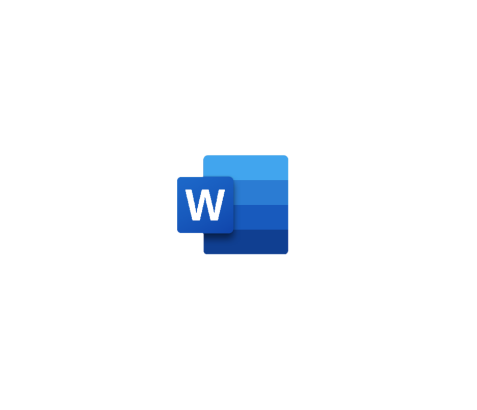

<h1 align="center"> TEAM ANTHANTA <h1>

  

## 📋 Table of contents
  - [Description](#description)
  - [Documentation](#docs)
  - [How to run](#install)
  - [Technologies](#technologies)
  - [Collaborators](#collaborators)

## 🔍 Description 

## 📃 Documentation 
### Code & Team Documentation

[Team Documentation]()

### QA Documentation
[QA Documentation]()
  

### Presentation
[Presentation]()

## 🚀 How to run 

## 🖥️ Technologies used 
### IDE & version control system:

### Programming languages & third-party libraries:
    

### Tools used for documentation, presentation & communication:
   

### PARTNERS:

## 🧑 Collaborators 

