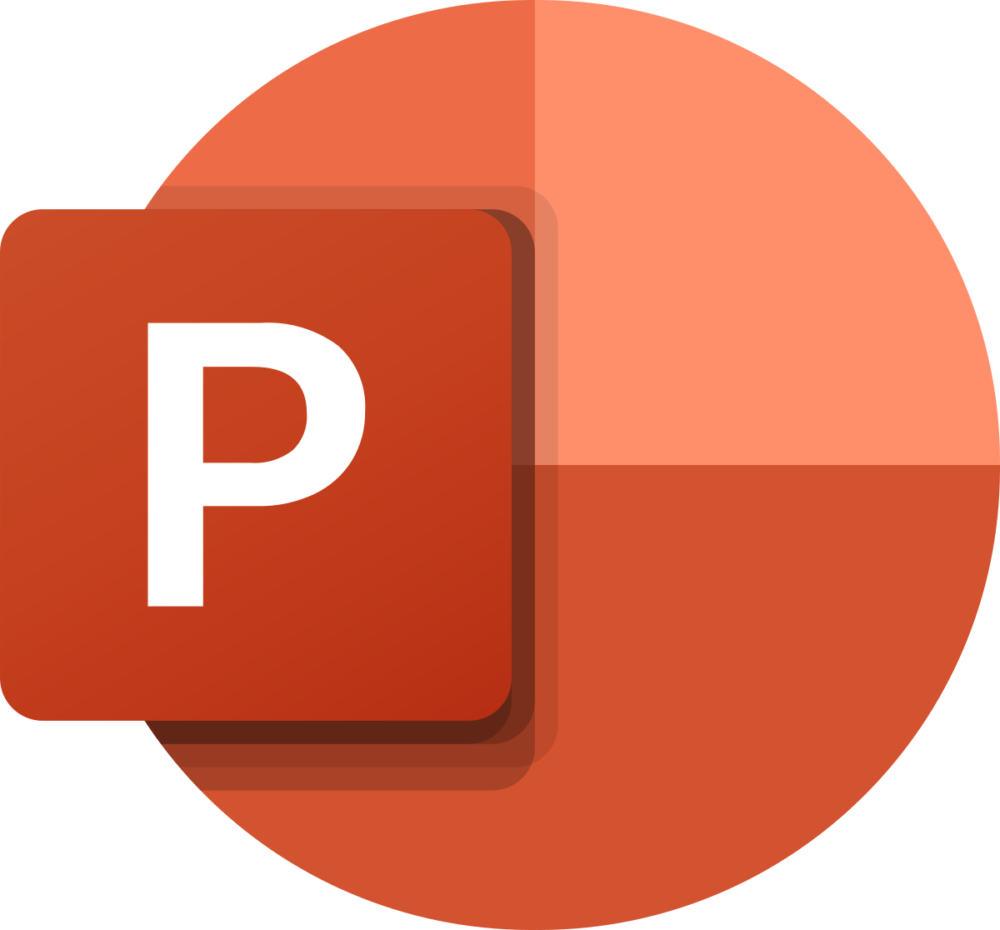

<h1 align="center"> TEAM ANTHANTA <h1>

  

## 📋 Table of contents
  - [Description](#description)
  - [Documentation](#docs)
  - [How to run](#install)
  - [Technologies](#technologies)
  - [Collaborators](#collaborators)

## 🔠Description 

 Our application strikes to improve students knowledge about history of the world , if you want to learn more you can chek out our <a href="https://github.com/codingburgas/school-project-assignment-anthanta/wiki">wiki</a> 

## 📃 Documentation 
### Code & Team Documentation

[Team Documentation](https://github.com/codingburgas/school-project-assignment-anthanta/blob/main/Documents/Project%20documentation.docx)

### QA Documentation
[QA Documentation]()
  

### Presentation
[Presentation](https://github.com/codingburgas/school-project-assignment-anthanta/blob/main/Documents/Project%20presentation.pptx)

## 🚀 How to run 

To install our application you have to copy the repo

## 🖥️ Technologies used 
### IDE & version control system:

### Programming languages & third-party libraries:
  

### Tools used for documentation, presentation & communication:
   

## 🧑 Collaborators 

[Filipa Popova](https://github.com/FHPopova21) - Backend developer 

[Dobril Peev](https://github.com/DDPeev21) - Backend developer

[Kristina Zheleva](https://github.com/KMZheleva21) - Scrum trainer

[Stilyan Gochev](https://github.com/SNGochev22) - Backend developer

[Lychezar Gospodinov](https://github.com/LGGospodinov22) - Backend developer

[Stefan Ivanov](https://github.com/SBIvanov22) - Backend developer

